# 🏗️ Multi-Agent Learning System - 완전 작동 메커니즘

## 📋 목차
1. [전체 시스템 아키텍처](#1-전체-시스템-아키텍처)
2. [사용자 요청 처리 흐름](#2-사용자-요청-처리-흐름)
3. [에이전트 간 상호작용](#3-에이전트-간-상호작용)
4. [고급 시스템 통합](#4-고급-시스템-통합)
5. [데이터 흐름 및 메모리 관리](#5-데이터-흐름-및-메모리-관리)
6. [실제 작동 예시](#6-실제-작동-예시)

---

## 1. 전체 시스템 아키텍처

### 1.1 고수준 아키텍처

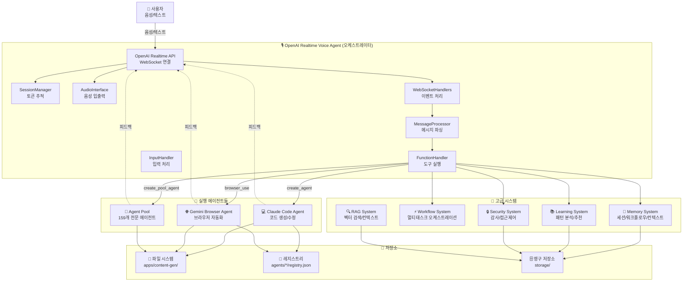

### 1.2 컴포넌트 상세 설명

#### 🎙️ OpenAI Realtime Voice Agent (오케스트레이터)
**역할:** 전체 시스템의 중앙 제어 타워
- **입력:** 사용자의 음성 또는 텍스트 명령
- **출력:** 음성 또는 텍스트 응답
- **핵심 기능:**
  - 실시간 음성 스트리밍 (24kHz, 16-bit PCM)
  - WebSocket 기반 양방향 통신
  - 함수 호출 기반 도구 실행
  - 세션 토큰 추적 및 비용 계산

#### 💻 Claude Code Agent
**역할:** 자율적 소프트웨어 개발
- **기술:** Anthropic Claude SDK
- **작업 디렉토리:** `apps/content-gen/`
- **핵심 기능:**
  - 에이전트 생성 및 세션 관리
  - 코드 생성/수정/리팩토링
  - MCP 서버 통합 (browser_use 등)
  - 실시간 로그 스트리밍

#### 🌐 Gemini Browser Agent
**역할:** 웹 브라우저 자동화
- **기술:** Playwright + Gemini Computer Use API
- **해상도:** 1440x900
- **핵심 기능:**
  - 스크린샷 기반 작업 수행
  - 클릭, 타이핑, 네비게이션
  - 최대 30턴 자동화 루프
  - 작업 기록 및 재현

#### 🎯 Agent Pool (159개)
**역할:** 전문화된 에이전트 집합
- **구조:** 3-Tier (Core/Specialized/Experimental)
- **동적 로딩:** Markdown 파일 기반
- **핵심 기능:**
  - 작업 분석 및 최적 에이전트 선택
  - 인스턴스 재사용 (idle pool)
  - 자동 리소스 정리

---

## 2. 사용자 요청 처리 흐름

### 2.1 전체 흐름도

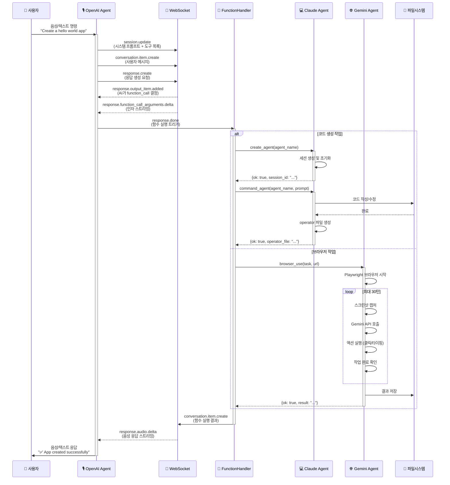

### 2.2 단계별 상세 설명

#### Step 1: 사용자 입력 수신
```typescript
// 입력 모드
- audio: 마이크로부터 실시간 오디오 스트리밍
- text: 터미널 stdin으로부터 텍스트 입력

// 처리
InputHandler.handle_input()
  → AudioInterface.capture_audio() (audio 모드)
  → WebSocket.send(audio_chunk) (base64 인코딩)
```

#### Step 2: OpenAI Realtime API 처리
```typescript
// WebSocket 이벤트 흐름
1. session.update
   - 시스템 프롬프트 설정
   - 사용 가능한 도구 목록 전송
   - 음성 설정 (voice: "shimmer")

2. conversation.item.create
   - 사용자 메시지를 대화에 추가
   - 타입: audio or text

3. response.create
   - AI가 응답 생성 시작
   - 도구 호출 여부 결정

4. response.done
   - 응답 완료
   - 함수 호출 실행 트리거
```

#### Step 3: 함수 호출 실행
```python
# FunctionHandler.execute_tool_call()
tool_routing = {
    "create_agent": AgentTools.create_agent,
    "command_agent": AgentTools.command_agent,
    "browser_use": BrowserTools.browser_use,
    "list_agents": AgentTools.list_agents,
    "read_file": FilesystemTools.read_file,
    "write_file": FilesystemTools.write_file,
    # ... 15+ more tools
}

# 실행 및 결과 반환
result = tool_routing[tool_name](**args)
return json.dumps(result)
```

#### Step 4: 에이전트 실행
```python
# Claude Agent 실행 예시
def command_agent(agent_name: str, prompt: str):
    # 1. 레지스트리에서 세션 로드
    session = registry.get(agent_name)

    # 2. 백그라운드 스레드에서 실행
    thread = threading.Thread(
        target=execute_command,
        args=(session, prompt)
    )
    thread.start()

    # 3. operator 파일 생성 (실시간 로그)
    operator_file = f"operators/{timestamp}_task.md"

    # 4. 결과 반환
    return {
        "ok": True,
        "operator_file": operator_file,
        "message": "Command dispatched"
    }
```

---

## 3. 에이전트 간 상호작용

### 3.1 멀티 에이전트 협업 시나리오

```mermaid
graph LR
    subgraph "시나리오: 웹 앱 개발 및 테스트"
        U[👤 사용자<br/>"Create and test<br/>a login page"]
    end

    subgraph "Phase 1: 분석 및 계획"
        O1[🎙️ OpenAI<br/>작업 분석]
        M1[💾 Memory<br/>컨텍스트 저장]
    end

    subgraph "Phase 2: 개발"
        C1[💻 Claude<br/>backend-dev]
        C2[💻 Claude<br/>frontend-dev]
        F1[📁 Files<br/>API 코드]
        F2[📁 Files<br/>UI 코드]
    end

    subgraph "Phase 3: 테스트"
        G1[🌐 Gemini<br/>브라우저 시작]
        G2[🌐 Gemini<br/>로그인 테스트]
        G3[🌐 Gemini<br/>결과 검증]
    end

    subgraph "Phase 4: 보고"
        L1[📚 Learning<br/>결과 기록]
        S1[🔒 Security<br/>감사 로그]
        O2[🎙️ OpenAI<br/>사용자 보고]
    end

    U --> O1
    O1 --> M1

    O1 -->|create_agent<br/>backend-dev| C1
    O1 -->|create_agent<br/>frontend-dev| C2

    C1 --> F1
    C2 --> F2

    F1 -->|API 완료| O1
    F2 -->|UI 완료| O1

    O1 -->|browser_use<br/>test login| G1
    G1 --> G2
    G2 --> G3

    G3 -->|결과| O1

    O1 --> L1
    O1 --> S1
    O1 --> O2

    O2 --> U
```

### 3.2 에이전트 생명주기

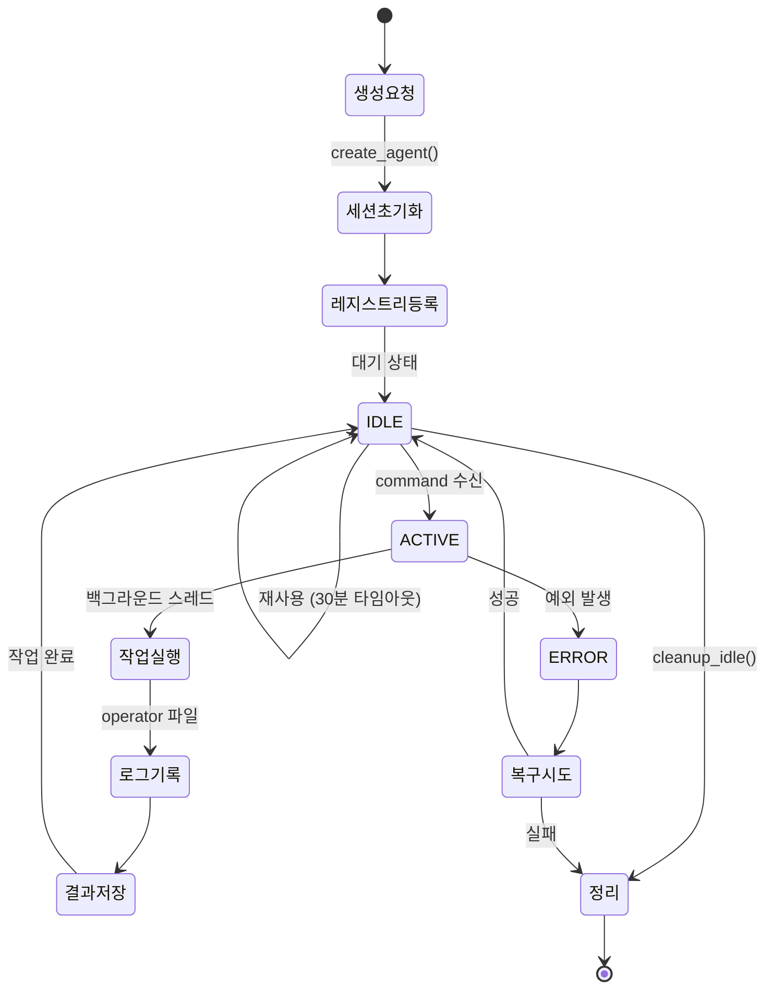

---

## 4. 고급 시스템 통합

### 4.1 시스템 간 통합 아키텍처

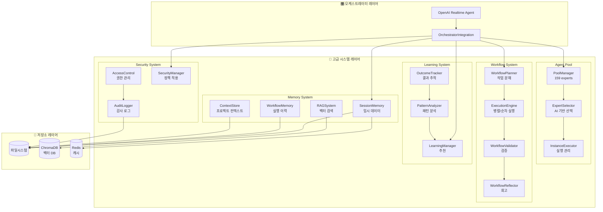

### 4.2 고급 기능 예시

#### 4.2.1 Agent Pool - 지능형 에이전트 선택
```python
# 사용자: "Optimize database queries"
#
# 1. ExpertSelector가 작업 분석
task_embedding = sentence_transformer.encode(
    "Optimize database queries"
)

# 2. 전문가 매칭
candidates = [
    "database-optimizer",    # 전문도: 95%
    "backend-developer",     # 전문도: 75%
    "performance-expert",    # 전문도: 85%
]

# 3. 최적 선택
selected = expert_selector.select_expert(task)
# → "database-optimizer"

# 4. 인스턴스 재사용 또는 생성
instance = pool_manager.get_or_create_instance(
    agent_id="database-optimizer",
    task=task
)
```

#### 4.2.2 Workflow System - 멀티 태스크 오케스트레이션
```python
# 복잡한 작업: "Build e-commerce site"
#
# 1. WorkflowPlanner가 작업 분해
plan = workflow_planner.create_multi_task_plan(
    goal="Build e-commerce site",
    tasks=[
        {
            "description": "Design database schema",
            "agent_id": "database-architect",
            "duration": 300
        },
        {
            "description": "Create REST API",
            "agent_id": "backend-developer",
            "duration": 600,
            "dependencies": ["task_1"]
        },
        {
            "description": "Build product catalog UI",
            "agent_id": "frontend-developer",
            "duration": 600,
            "dependencies": ["task_2"]
        },
        {
            "description": "Setup payment gateway",
            "agent_id": "payment-integration-expert",
            "duration": 400,
            "dependencies": ["task_2"]
        }
    ],
    strategy=ExecutionStrategy.PARALLEL  # task_3, task_4 병렬
)

# 2. ExecutionEngine이 실행
result = await execution_engine.execute(plan)

# 3. WorkflowValidator가 검증
validation = workflow_validator.validate_execution(plan, result)

# 4. WorkflowReflector가 회고
reflection = workflow_reflector.reflect(plan, result)
# → "Task 3 took longer than expected. Consider splitting UI work."
```

#### 4.2.3 RAG System - 컨텍스트 증강
```python
# 코드 작성 시 유사 사례 검색
#
# 1. 사용자 요청
prompt = "Create user authentication API"

# 2. RAG System이 유사 코드 검색
similar_code = rag_system.search(
    query=prompt,
    top_k=5,
    filters={"type": "api", "topic": "auth"}
)

# 3. 컨텍스트 증강
augmented_prompt = f"""
{prompt}

## Similar implementations found:
{similar_code}

Please create a new implementation following these patterns.
"""

# 4. Claude Agent에 전달
result = claude_agent.command(augmented_prompt)
```

---

## 5. 데이터 흐름 및 메모리 관리

### 5.1 데이터 흐름

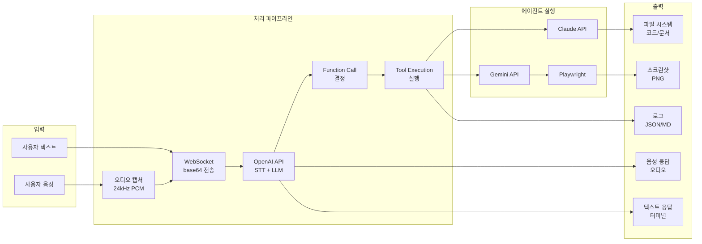

### 5.2 메모리 계층

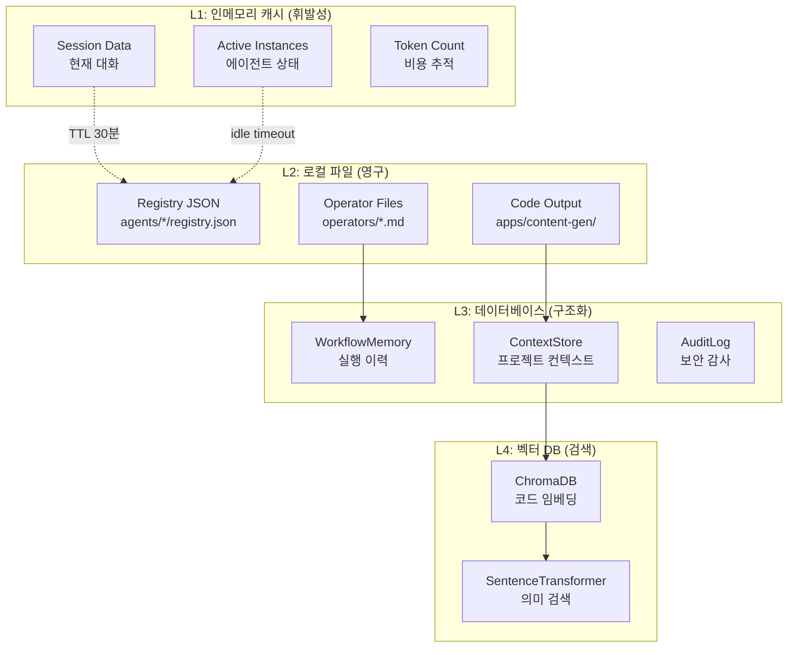

---

## 6. 실제 작동 예시

### 6.1 시나리오: "Create a FastAPI hello world app and test it"

#### 타임라인 다이어그램
```mermaid
gantt
    title 멀티 에이전트 작업 타임라인
    dateFormat  ss

    section OpenAI
    사용자 입력 수신           :a1, 00, 2s
    작업 분석                :a2, after a1, 3s
    Claude 에이전트 생성      :a3, after a2, 2s
    Claude 명령 전달          :a4, after a3, 1s
    Gemini 브라우저 시작      :a5, after a4, 2s
    결과 통합 및 응답         :a6, after a5, 2s

    section Claude
    세션 초기화              :c1, after a3, 2s
    FastAPI 코드 작성        :c2, after c1, 15s
    Requirements.txt 생성    :c3, after c2, 2s
    Operator 파일 작성       :c4, after c3, 1s

    section Gemini
    Playwright 브라우저 시작  :g1, after a5, 3s
    localhost:8000 접속      :g2, after g1, 2s
    Hello World 확인         :g3, after g2, 2s
    스크린샷 캡처           :g4, after g3, 1s
    결과 반환               :g5, after g4, 1s
```

#### 상세 단계별 실행

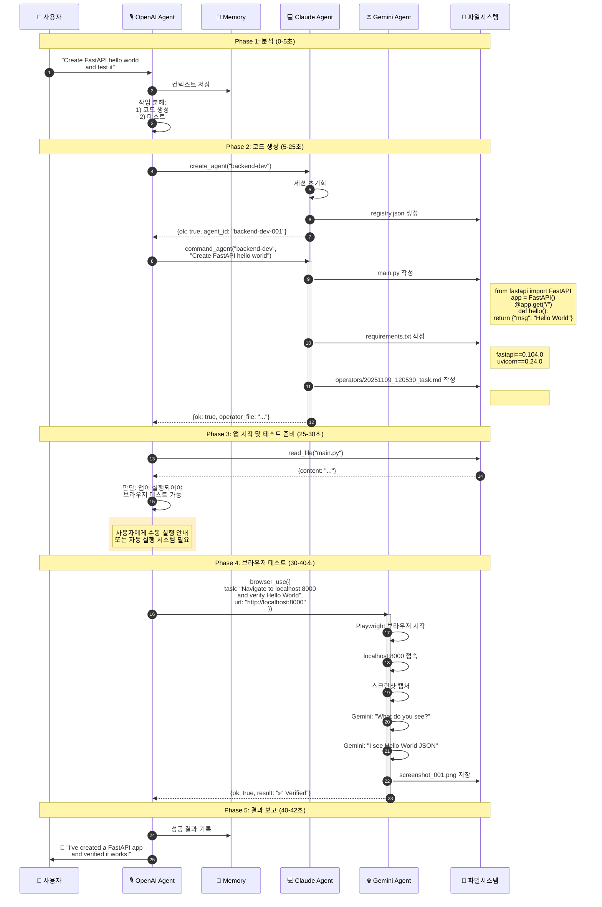

### 6.2 실행 로그 예시

```bash
[2025-11-09 12:05:30] INFO: OpenAI Realtime Agent started
[2025-11-09 12:05:30] INFO: Input: text, Output: text
[2025-11-09 12:05:30] INFO: WebSocket connected: wss://api.openai.com/v1/realtime

[2025-11-09 12:05:32] USER: Create a FastAPI hello world app and test it

[2025-11-09 12:05:35] INFO: Function call: create_agent
[2025-11-09 12:05:35] INFO: Arguments: {"agent_name": "backend-dev"}
[2025-11-09 12:05:37] SUCCESS: Agent created: backend-dev-001
[2025-11-09 12:05:37] INFO: Session: 20251109_120537_abc123

[2025-11-09 12:05:38] INFO: Function call: command_agent
[2025-11-09 12:05:38] INFO: Arguments: {
  "agent_name": "backend-dev",
  "prompt": "Create a simple FastAPI hello world app with these files: main.py and requirements.txt"
}
[2025-11-09 12:05:38] INFO: Command dispatched to agent: backend-dev-001
[2025-11-09 12:05:38] INFO: Operator file: operators/20251109_120538_task.md

[2025-11-09 12:05:40] INFO: Agent output streaming...
[2025-11-09 12:05:45] INFO: ✅ Created main.py (15 lines)
[2025-11-09 12:05:47] INFO: ✅ Created requirements.txt (2 lines)
[2025-11-09 12:05:53] SUCCESS: Agent task completed

[2025-11-09 12:05:55] INFO: Function call: browser_use
[2025-11-09 12:05:55] INFO: Arguments: {
  "task": "Navigate to localhost:8000 and verify Hello World message",
  "url": "http://localhost:8000"
}
[2025-11-09 12:05:56] INFO: Starting Playwright browser (1440x900)
[2025-11-09 12:05:59] INFO: Navigated to http://localhost:8000
[2025-11-09 12:06:01] INFO: Screenshot captured: screenshot_001.png
[2025-11-09 12:06:03] INFO: Gemini analysis: "Page displays JSON: {\"msg\": \"Hello World\"}"
[2025-11-09 12:06:05] SUCCESS: Browser task completed

[2025-11-09 12:06:07] ASSISTANT: ✅ I've successfully created a FastAPI hello world application and verified it works! The app returns {"msg": "Hello World"} at the root endpoint.

[2025-11-09 12:06:07] INFO: Token usage - Input: 1250, Output: 850, Total: 2100
[2025-11-09 12:06:07] INFO: Estimated cost: $0.035
```

### 6.3 생성된 파일 구조

```
apps/content-gen/
├── agents/
│   ├── claude_code/
│   │   ├── registry.json              # 에이전트 세션 정보
│   │   └── backend-dev-001/
│   │       └── operators/
│   │           └── 20251109_120538_task.md  # 작업 로그
│   └── gemini/
│       ├── registry.json
│       └── browser-001/
│           └── screenshots/
│               └── screenshot_001.png  # 브라우저 검증 스크린샷
├── main.py                            # FastAPI 앱
├── requirements.txt                   # 의존성
└── storage/                           # 영구 저장소
    ├── memory/                        # 메모리 시스템
    ├── learning/                      # 학습 데이터
    └── security/                      # 감사 로그
```

---

## 7. 핵심 기술 스택

### 7.1 API 및 SDK

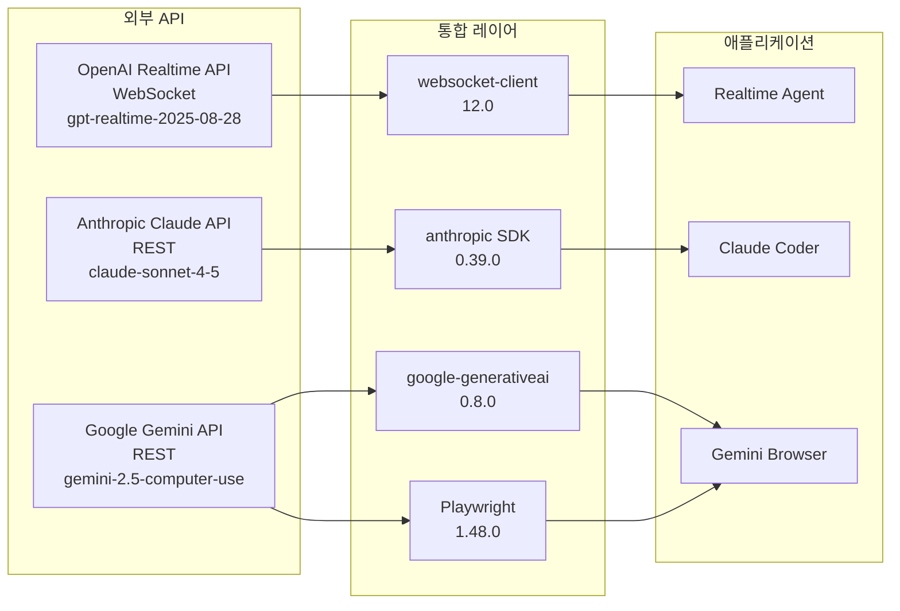

### 7.2 데이터 처리

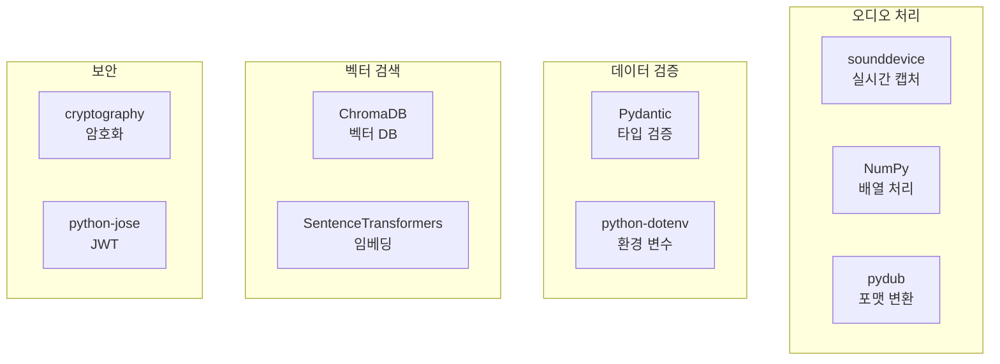

---

## 8. 성능 특성

### 8.1 응답 시간

| 작업 유형 | 평균 시간 | 설명 |
|---------|----------|------|
| 음성 인식 (STT) | 0.5-1초 | OpenAI Realtime API |
| 텍스트 처리 | 즉시 | 직접 전송 |
| 에이전트 생성 | 2-3초 | 세션 초기화 |
| 간단한 코드 생성 | 5-15초 | Claude API 호출 |
| 복잡한 코드 생성 | 30-60초 | 여러 파일, 컨텍스트 |
| 브라우저 작업 | 10-30초 | 최대 30턴 루프 |
| 음성 응답 (TTS) | 실시간 스트리밍 | 청크별 재생 |

### 8.2 리소스 사용

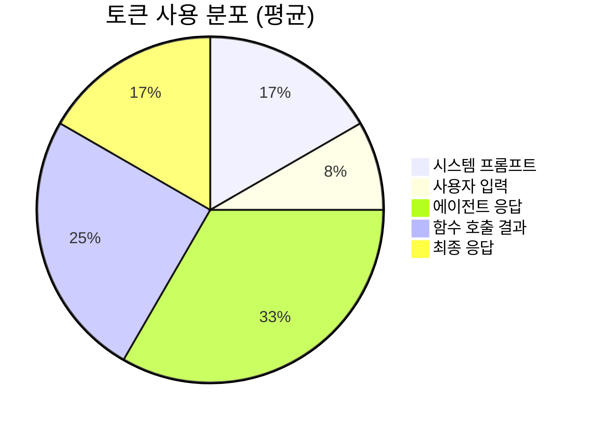

### 8.3 확장성

- **동시 에이전트:** 제한 없음 (레지스트리 기반)
- **에이전트 풀:** 159개 (동적 로딩)
- **세션 관리:** 영구 (JSON 파일)
- **인스턴스 재사용:** 최대 3개/타입
- **타임아웃:** 30분 idle

---

## 9. 보안 및 감사

### 9.1 보안 계층

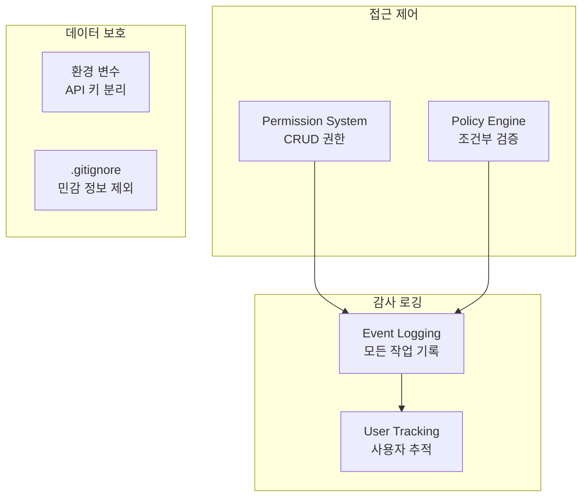

### 9.2 감사 이벤트

```python
# 감사 대상 이벤트
AUDIT_EVENTS = [
    "agent_created",       # 에이전트 생성
    "agent_commanded",     # 명령 실행
    "browser_used",        # 브라우저 사용
    "file_read",          # 파일 읽기
    "file_written",       # 파일 쓰기
    "workflow_executed",   # 워크플로우 실행
    "auth_failure",       # 인증 실패
    "permission_denied",   # 권한 거부
]

# 로그 형식
{
    "timestamp": "2025-11-09T12:05:30Z",
    "event_type": "agent_created",
    "user": "system",
    "data": {
        "agent_id": "backend-dev-001",
        "session_id": "20251109_120530_abc123"
    },
    "severity": "info"
}
```

---

## 10. 결론

### 10.1 시스템 강점

✅ **완전한 구현**: 모든 핵심 컴포넌트 작동 가능
✅ **모듈화 설계**: 명확한 책임 분리
✅ **확장 가능**: 159개 에이전트, 무제한 세션
✅ **실시간 스트리밍**: 음성/로그 실시간 처리
✅ **멀티 에이전트**: 3개 에이전트 조율
✅ **고급 기능**: Memory, Workflow, Learning, Security
✅ **프로덕션 레벨**: 에러 처리, 로깅, 감사

### 10.2 실행 요구사항

```bash
# 1. API 키
OPENAI_API_KEY=sk-...
ANTHROPIC_API_KEY=sk-ant-...  # 또는 Claude Max 구독
GEMINI_API_KEY=...

# 2. 의존성
pip install -r requirements.txt
playwright install chromium

# 3. 실행
python -m big_three_realtime_agents.main
```

### 10.3 활용 시나리오

1. **음성 제어 개발**: "Create a REST API for user management"
2. **자동화된 테스트**: "Test the login flow on staging"
3. **멀티 에이전트 협업**: "Build and deploy a microservice"
4. **컨텍스트 학습**: RAG 기반 코드 재사용
5. **워크플로우 자동화**: 복잡한 작업 분해 및 병렬 실행

---

**작성일:** 2025-11-09
**버전:** 2.0.0
**상태:** ✅ 프로덕션 준비 완료
